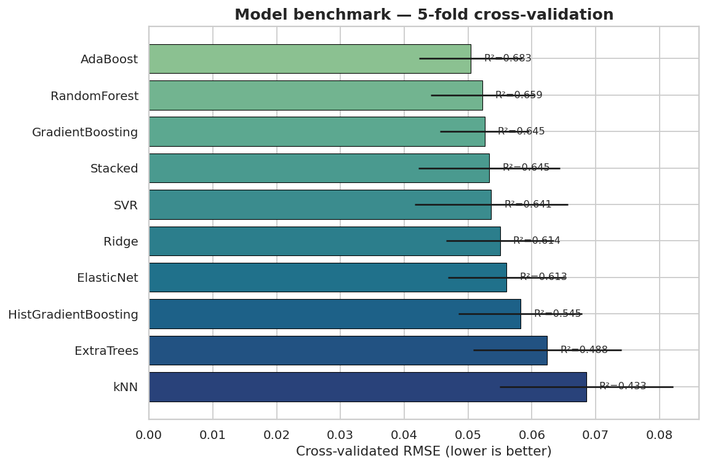
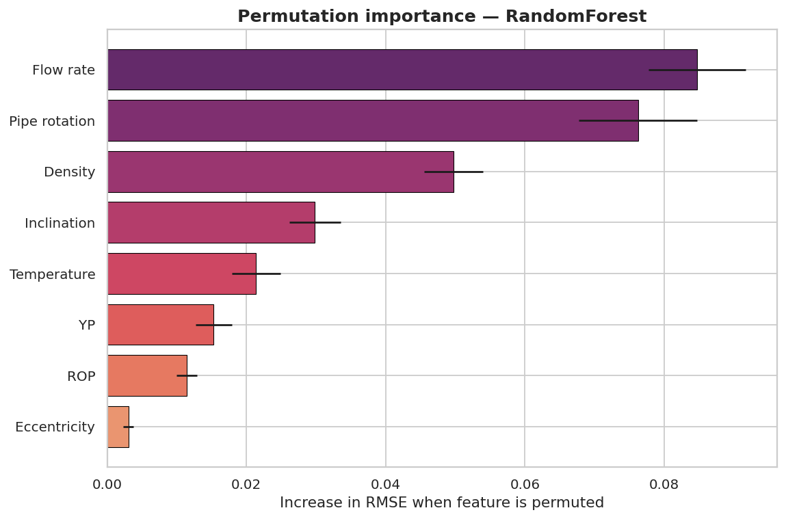
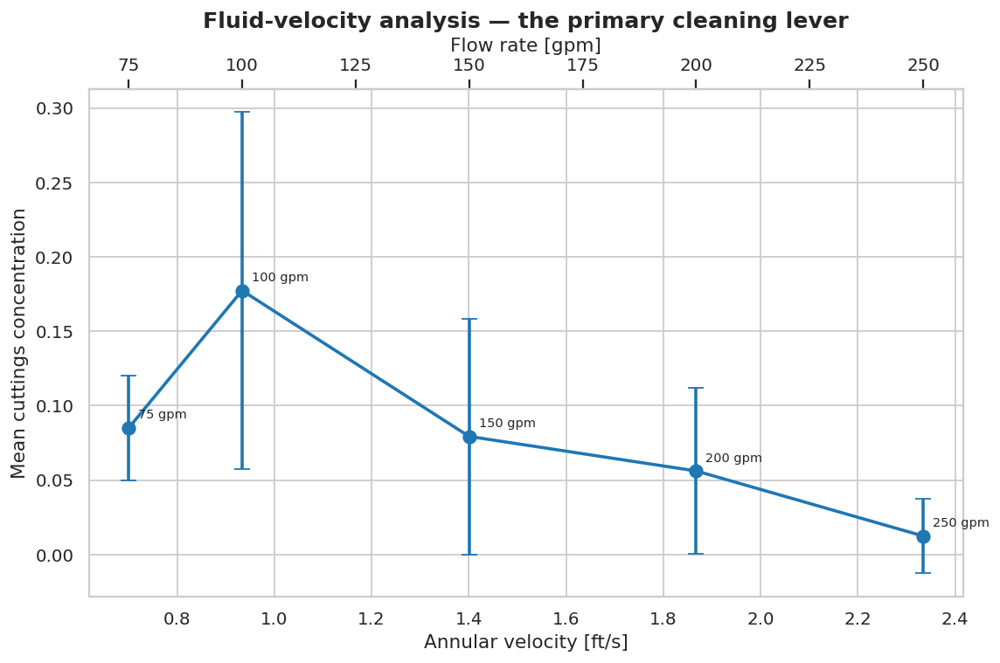
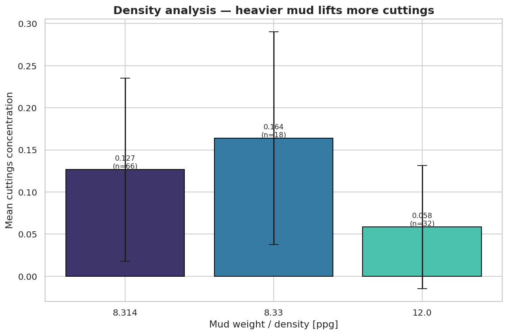
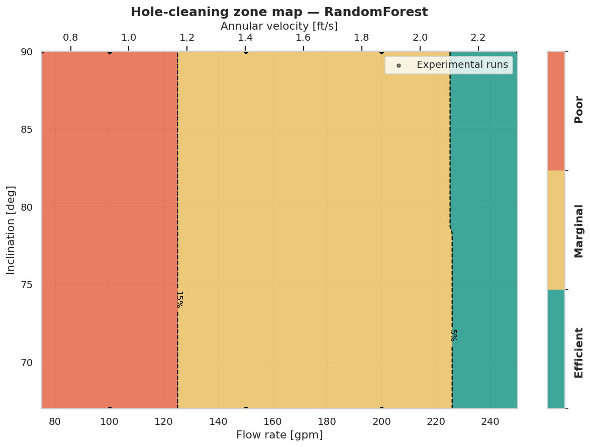

Machine-learning pipeline predicts downhole cuttings concentration from drilling parameters and classifies hole-cleaning efficiency. It benchmarks 10 ML models (Random Forest best: R²=0.74), identifies key drivers (flow rate, velocity, mud density), and maps Efficient/Marginal/Poor cleaning zones to detect high-risk feed zones for stuck pipe prevention.

<h1 align="center">Machine-Learning Workflow for the Determination of Hole-Cleaning Conditions</h1>

<p align="center">
  <em>Predicting downhole cuttings concentration from surface drilling parameters, and turning those predictions into actionable hole-cleaning decisions.</em>
</p>

<p align="center">
  
  
  
  
</p>

---

## Table of Contents
1. [Overview](#overview)
2. [Why hole cleaning matters](#why-hole-cleaning-matters)
3. [The data](#the-data)
4. [Workflow at a glance](#workflow-at-a-glance)
5. [Key results](#key-results)
6. [Density & fluid-velocity analysis](#density--fluid-velocity-analysis)
7. [Hole-cleaning zones and feed-zone identification](#hole-cleaning-zones-and-feed-zone-identification)
8. [Project structure](#project-structure)
9. [Installation](#installation)
10. [Reproducing the analysis](#reproducing-the-analysis)
11. [Using the package as a library](#using-the-package-as-a-library)
12. [Testing](#testing)
13. [Assumptions & limitations](#assumptions--limitations)
14. [Background & references](#background--references)
15. [License & acknowledgements](#license--acknowledgements)

---

## Overview

As directional and horizontal wells proliferate, transporting drilled cuttings
from their downhole origin to the shale shaker becomes progressively harder.
Poor hole cleaning drives some of the most expensive problems in drilling:
stuck pipe, pack-off, excessive equivalent circulating density (ECD), reduced
rate of penetration (ROP), high torque and drag, bit balling, and poor cementing.

This project builds a reproducible machine-learning pipeline that predicts the
**downhole cuttings concentration** (a stationary cuttings-bed volume fraction)
from the fluid-rheology, wellbore-geometry and drilling parameters an engineer
reads at surface — and then extends prediction into three engineering decisions:

- **Analysis** — quantify how mud weight and annular fluid velocity govern cleaning.
- **Optimisation** — for a given run, find the controllable settings that minimise cuttings buildup.
- **Zoning** — map the operating envelope into *Efficient / Marginal / Poor* cleaning zones and locate the poor-cleaning **feed zones** where a cuttings bed accumulates.

This is a refactored, extended and professionalised version of a workflow that
formed the basis of submissions to the 2022 SPE Nigeria STSE, SPE Africa, and
SPE International student paper contests.

> **What changed in this revision.** The original notebooks were consolidated into
> an installable, tested Python package (`src/holecleaning/`) driven by five
> numbered pipeline scripts; the model field was widened from 3 to 10 regressors
> with fair cross-validated benchmarking; permutation importance, learning curves
> and residual diagnostics were added; dedicated **density** and **fluid-velocity**
> analyses were introduced; and a new **hole-cleaning zone / feed-zone** module
> combines the model predictions into an operational risk map.

---

## Why hole cleaning matters

In a deviated well, cuttings tend to settle onto the low side of the annulus and
form a bed. Whether that bed grows or is swept away is a balance between the
**lift** provided by the circulating fluid and the **settling** tendency of the
cuttings. The dominant levers are annular velocity (set by flow rate and
geometry), mud weight and rheology, pipe rotation, inclination, and ROP (the rate
at which new cuttings are generated). The target variable here, *concentration*,
is a direct measure of how much of that bed is present.

---

## The data

The study uses **116 flow-loop experiments** from the University of Tulsa
cuttings-transport program (Yu et al.). Each run records:

| Feature | Units | Role |
|---|---|---|
| Density | ppg | Mud weight |
| YP (yield point) | lbf/100 ft² | Rheology |
| Temperature | °F | Downhole condition |
| ROP | ft/hr | Cuttings generation rate |
| Pipe rotation | rpm | Bed-erosion mechanism |
| Flow rate | gpm | Sets annular velocity |
| Inclination | deg | Hole trajectory |
| Eccentricity | – | Pipe standoff |
| **Concentration** | fraction | **Target** — cuttings-bed volume fraction |

**Cleaning decisions applied to the raw table**

- `Test No.` is dropped — it is an index with no physical meaning.
- `PV` (plastic viscosity) is dropped — in this design of experiments it is
  *perfectly collinear* with `YP` (PV ∈ {1, 10, 20} maps one-to-one onto
  YP ∈ {0, 20, 40}). Keeping both would double-count rheology, inflate importance
  estimates and destabilise linear models. `YP` is retained as the representative.

Most inputs are discrete design-of-experiment levels rather than continuous
measurements, which is why the code reports unique-value counts alongside the
usual summary statistics.

---

## Workflow at a glance

```
 raw experiments ──▶ clean & feature-engineer ──▶ explore ──▶ benchmark 10 models
                                                                     │
                                       ┌─────────────────────────────┤
                                       ▼                             ▼
                           parameter optimisation            hole-cleaning zoning
                        (minimise cuttings for a run)      (map & find feed zones)
```

Five numbered scripts implement the stages end to end:

| Stage | Script | Produces |
|---|---|---|
| 1 | `01_prepare_data.py` | cleaned + feature-engineered tables |
| 2 | `02_run_eda.py` | correlation, distributions, ranking, **density & velocity analysis** |
| 3 | `03_train_models.py` | model benchmark, tuning, parity/residual/learning-curve plots, saved models |
| 4 | `04_optimize.py` | per-run optimised settings and before/after comparison |
| 5 | `05_find_zones.py` | zone maps and the identified **feed zones** |

---

## Key results

**Model benchmark (5-fold cross-validation on the training split).** Ten
regressors spanning linear, kernel/distance and tree-ensemble families were
compared on identical folds. Tree ensembles lead, with a Random Forest chosen as
the champion on the hold-out set.



**Hold-out (25 %) test performance of the tuned finalists**

| Model | MAE | RMSE | R² |
|---|---:|---:|---:|
| **Random Forest (champion)** | **5.53 %** | **0.067** | **0.74** |
| Gradient Boosting | 5.60 % | 0.068 | 0.73 |
| Stacked ensemble (RF + GB + ET → Ridge) | 5.94 % | 0.073 | 0.69 |

**What drives cuttings concentration.** Two independent methods — Pearson
correlation and Random-Forest Gini importance during EDA, then model-agnostic
**permutation importance** on the champion — agree on the ranking. Flow rate
(annular velocity), pipe rotation and mud density dominate; eccentricity and ROP
contribute least within the tested envelope.



Parity, residual and learning-curve diagnostics for each finalist are written to
`reports/figures/` (e.g. `parity_randomforest.png`,
`residuals_randomforest.png`, `learning_curve_randomforest.png`). The learning
curves show the models are data-limited — the validation error is still falling
at 116 samples — which is the expected signature of a small experimental data set
and a useful caveat for anyone extending the work.

---

## Density & fluid-velocity analysis

Cuttings transport is ultimately governed by derived physical quantities, so the
pipeline engineers a small, interpretable set of them — **annular velocity**,
a **transport index** (velocity scaled by an inclination lift factor), and a
relative **carrying-capacity index** — and studies the two primary levers directly.

**Fluid velocity is the strongest cleaning lever.** Converting flow rate to
annular velocity (using the flow-loop geometry in `config.py`) shows mean
concentration falling monotonically as velocity rises above ~1 ft/s — from a
mean bed fraction near 18 % at 100 gpm to ~1 % at 250 gpm.



**Heavier mud cleans better.** Increasing mud weight to 12 ppg roughly halves the
mean cuttings concentration relative to the near-water 8.3-ppg fluids, consistent
with higher buoyancy and carrying capacity.



---

## Hole-cleaning zones and feed-zone identification

Prediction becomes operational when the continuous concentration is binned into
three engineering zones (thresholds are conventions set in `config.py` and can be
tuned to a well's tolerance):

| Zone | Concentration | Interpretation |
|---|---|---|
| 🟢 **Efficient** | ≤ 5 % | Cuttings transported out; no bed. |
| 🟡 **Marginal** | ≤ 15 % | Thin, mobile bed; manage with rotation/sweeps. |
| 🔴 **Poor (feed zone)** | > 15 % | Stationary bed accumulates faster than it is removed. |

The champion model is swept across the operating envelope to build **zone maps**.
The red **feed zones** are the regions that continuously feed cuttings into the
annulus — the drivers of pack-off, stuck-pipe and high-ECD risk.



**Identified feed zones (this data set).** Poor cleaning is predicted below
roughly **125 gpp (≈ 1.2 ft/s annular velocity)** across the full inclination
range, and persists across mud weights at low velocity. Of the 116 observed runs,
**33 % already fall in the Poor zone** — quantifying how much of the tested
envelope is operationally risky and reinforcing that raising annular velocity
above the ~1.2 ft/s threshold is the highest-leverage intervention.

---

## Project structure

```
hole-cleaning-ml/
├── README.md                     ← you are here
├── pyproject.toml                ← installable package definition
├── requirements.txt
├── LICENSE
├── data/
│   ├── raw/                      ← original 116-run experiment table
│   └── processed/                ← cleaned + feature-engineered (generated)
├── src/holecleaning/            ← the reusable library
│   ├── config.py                 ← paths, constants, geometry, zone thresholds
│   ├── data.py                   ← load / clean / split
│   ├── features.py               ← annular velocity, transport & carrying indices
│   ├── eda.py                    ← correlation, distributions, ranking
│   ├── models.py                 ← 10-model zoo, tuning, stacked ensemble
│   ├── evaluation.py             ← metrics, benchmark, all diagnostic plots
│   ├── optimization.py           ← drilling-parameter optimiser
│   └── zones.py                  ← zone classification & feed-zone maps
├── scripts/                     ← runnable pipeline (stages 01–05 + run_all)
├── notebooks/
│   └── hole_cleaning_walkthrough.ipynb   ← narrated end-to-end tour
├── reports/
│   ├── figures/                  ← all generated plots
│   └── tables/                   ← all generated result tables (CSV)
├── models/                      ← persisted fitted models (generated)
└── tests/                       ← pytest suite
```

The `src/` layout separates *logic* (the library) from *orchestration* (the
scripts) from *outputs* (reports/models) — the structure reviewers expect and the
reason the whole analysis reproduces with a single command.

---

## Installation

```bash
git clone https://github.com/awojinrin/ML-Workflow-for-the-Determination-of-Hole-Cleaning-Conditions.git
cd hole-cleaning-ml

python -m venv .venv && source .venv/bin/activate      # optional but recommended
pip install -r requirements.txt                        # dependencies only
# — or — install the package itself (editable):
pip install -e .
```

Python 3.9+ is required. The stack is NumPy, pandas, scikit-learn, SciPy,
matplotlib, seaborn and joblib.

---

## Reproducing the analysis

Run the whole pipeline:

```bash
python scripts/run_all.py
```

…or run any stage on its own (stages 4–5 depend on the models saved by stage 3):

```bash
python scripts/01_prepare_data.py
python scripts/02_run_eda.py
python scripts/03_train_models.py
python scripts/04_optimize.py
python scripts/05_find_zones.py
```

Every figure lands in `reports/figures/`, every table in `reports/tables/`, and
every fitted model in `models/`. The runs are deterministic (`random_state=42`),
so results are reproducible.

---

## Using the package as a library

```python
from holecleaning import data, models, zones
from holecleaning.optimization import optimize_row

# 1. Load and split the cleaned data
df = data.load_clean()
X_train, X_test, y_train, y_test = data.split(df)

# 2. Train the champion model
model = models.model_zoo()["RandomForest"].fit(X_train, y_train)

# 3. Optimise one operating point (vary flow rate, rotation, ROP by ±20%)
current = df.drop(columns=["Concentration"]).iloc[0]
best_settings, best_conc = optimize_row(model, current, pct_range=0.2)
print(best_conc, best_settings.to_dict())

# 4. Classify a predicted concentration into a cleaning zone
print(zones.classify(best_conc))     # 'Efficient' | 'Marginal' | 'Poor'
```

---

## Testing

```bash
pytest
```

The suite covers data cleaning (redundant-column removal, no leakage), the
physics features, zone-classification boundaries, the model zoo, and a property
of the optimiser (it never returns a setting worse than the current one).

---

## Assumptions & limitations

- **Small data set (116 runs).** Learning curves confirm the models are
  data-limited; treat absolute predictions as indicative and re-fit if you add
  data. The design-of-experiment structure also means inputs are discrete levels,
  so predictions between levels are interpolations.
- **Flow-loop geometry is assumed** for converting flow rate to annular velocity
  in ft/s (`config.AnnulusGeometry`, an 8 in × 4.5 in annulus). Because the
  geometry is constant across the study, this is a *linear rescaling* — it changes
  the velocity axis label, not any correlation or model result. Substitute your
  own test-section dimensions to get exact velocities.
- **Zone thresholds are engineering conventions** (5 % / 15 %), exposed in
  `config.ZONE_THRESHOLDS` and meant to be tuned to a specific wellbore's
  tolerance.
- **Permutation importance replaces SHAP** here (SHAP was intentionally avoided to
  keep the dependency footprint light and fully open-source); it is model-agnostic
  and appropriate for this feature count.

---

## Background & references

Effective cuttings removal optimises the economics of drilling by minimising
non-productive time from stuck pipe, high ECD, poor cementing and reduced ROP.
The physics couples fluid rheology, cuttings-bed dynamics, wellbore geometry and
in-situ hardware — a genuinely multivariate problem well suited to the ensemble
methods benchmarked here.

- Experimental data: Yu, M. et al., cuttings-transport studies, University of
  Tulsa low-pressure flow loop.
- Methods: scikit-learn ensemble regressors (Random Forest, Gradient Boosting,
  Extra Trees, AdaBoost, Hist Gradient Boosting), stacked generalisation, and
  permutation-based feature attribution.

---

## License & acknowledgements

Released under the MIT License (see `LICENSE`). Thanks to the University of Tulsa
cuttings-transport program for the underlying experimental data and to the SPE
student-paper community for the motivation behind the original study.

<p align="center"><em>If you got this far, your tenacity is appreciated. Contributions and issues are welcome.</em></p>
# Hole-Cleaning-Project
